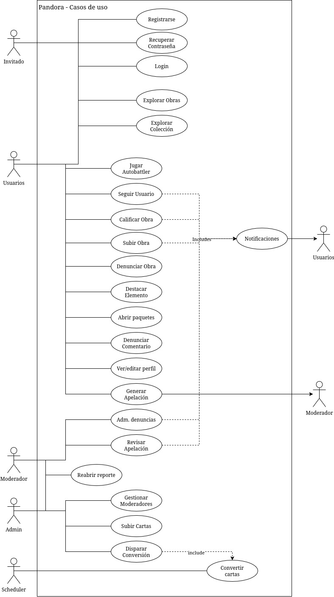

# Pandora — Casos de Uso

 Este documento cubre actores, permisos y el catálogo completo de casos de uso, con sus flujos principales, alternativos y observaciones.

# 1. Actores y permisos

## 1.1 Invitado

Puede:

- explorar obras;
- buscar y filtrar obras;
- consultar detalles públicos de obras;
- explorar cartas y perfiles públicos, según la información disponible;
- registrarse;
- iniciar sesión.

No puede:

- publicar obras;
- comentar;
- calificar;
- denunciar;
- seguir usuarios;
- gestionar colección propia;
- abrir paquetes;
- jugar como usuario autenticado.

## 1.2 Usuario autenticado

Un mismo usuario puede comportarse funcionalmente como artista y coleccionista; no se requieren cuentas separadas. Esta decisión coincide con la observación incluida en los casos de uso originales.

Puede:

- administrar su perfil;
- publicar obras;
- comentar;
- calificar obras en período activo;
- denunciar obras o comentarios;
- seguir usuarios;
- marcar favoritos;
- administrar su colección;
- abrir paquetes disponibles;
- iniciar una batalla local;
- consultar notificaciones.

## 1.3 Moderador

Puede:

- acceder al panel de moderación;
- consultar reportes pendientes;
- revisar el contenido reportado;
- resolver reportes;
- emitir advertencias;
- eliminar obras o comentarios;
- banear usuarios;
- descartar reportes.

## 1.4 Admin

Puede hacer todo lo que puede hacer un moderador, más:

- otorgar y revocar el rol `moderator` a otros usuarios;
- revisar reportes ya resueltos (archivados) y reabrirlos, revirtiendo la sanción aplicada (restaurar obra/comentario o desbanear al usuario) sin pasar por el flujo de apelación;
- cargar directamente una obra ya convertida en carta (imagen + rareza + estadísticas), sin pasar por el período de calificación real;
- disparar manualmente el ciclo de conversión que normalmente corre por CRON, para no depender del reloj (pensado para demos).

El rol `admin` no se otorga ni se revoca a través de la aplicación — es un rol de confianza asignado fuera de este flujo (p. ej. directamente en base de datos).

---

# 2. Catálogo de casos de uso

Los casos de uso cubren subir obra, calificar, explorar, colección, moderación, seguimiento, batalla, paquetes, destacados, reportes, notificaciones, registro, login, recuperación de contraseña y las herramientas de administración/apelaciones.

| ID | Nombre | Actor principal |
|---|---|---|
| CU01 | Registrarse | Invitado |
| CU02 | Login | Invitado |
| CU03 | Subir obra | Usuario autenticado |
| CU04 | Explorar obras | Invitado o usuario |
| CU05 | Calificar obra mediante Q2Q | Usuario autenticado |
| CU06 | Conversión de obra a carta | CRON / sistema |
| CU07 | Explorar colección/cartas | Invitado o usuario autenticado |
| CU08 | Abrir paquete | Usuario autenticado |
| CU09 | Jugar autobattler | Usuario autenticado |
| CU10 | Seguir usuario | Usuario autenticado |
| CU11 | Destacar obra o carta | Usuario autenticado |
| CU12 | Denunciar obra | Usuario autenticado |
| CU13 | Denunciar comentario | Usuario autenticado |
| CU14 | Administrar denuncias | Moderador |
| CU15 | Notificaciones | Usuario autenticado |
| CU16 | Ver/editar perfil | Usuario autenticado |
| CU17 | Gestionar rol de moderador | Admin |
| CU18 | Reabrir un reporte resuelto | Admin |
| CU19 | Apelar una sanción | Usuario autenticado afectado |
| CU20 | Revisar una apelación | Moderador o Admin |
| CU21 | Cargar carta directamente (Admin) | Admin |
| CU22 | Disparar el ciclo de conversión manualmente (Admin) | Admin |
| CU23 | Recuperar contraseña olvidada | Invitado |

---

## CU01 — Registrarse

**Actor principal:** Invitado
**Precondición:** No existe una sesión autenticada.
**Postcondición:** Cuenta creada. Si es registro local, queda pendiente de verificación o en estado restringido hasta confirmar email.

### Flujo principal

1. El usuario accede a la pantalla de registro.
2. Introduce email, username y contraseña.
3. El backend valida formato, longitud y unicidad.
4. Se hashea la contraseña.
5. Se crea la cuenta.
6. Se genera un token/challenge de verificación.
7. Se envía el correo de verificación.
8. El usuario abre el enlace o introduce el código recibido.
9. El backend valida el challenge.
10. La cuenta queda verificada.
11. Se informa que el registro fue exitoso.

### Flujos alternativos / excepciones

- **A1:** El email ya existe. Se rechaza el registro.
- **A2:** El username ya existe. Se rechaza el registro.
- **A3:** Email inválido. Se devuelve error de validación.
- **A4:** Contraseña no válida. Se devuelve error de validación.
- **A5:** El envío del correo falla. La cuenta queda pendiente y se permite reintentar el envío.
- **A6:** Challenge expirado. Se solicita uno nuevo.
- **A7:** Challenge inválido. Se rechaza la confirmación.

### Notas de implementación

Los tokens de verificación deben expirar y ser de un solo uso.

---

## CU02 — Login

**Actor principal:** Invitado
**Precondición:** Cuenta registrada.
**Postcondición:** Sesión autenticada.

### Flujo principal

1. El usuario abre login.
2. Ingresa email y contraseña.
3. El backend aplica rate limit.
4. Busca el usuario.
5. Verifica credenciales.
6. Verifica el estado de la cuenta.
7. Genera sesión/JWT.
8. Devuelve el resultado de autenticación.

### Alternativo

- **A1:** Credenciales inválidas -> respuesta genérica de autenticación fallida.
- **A2:** Demasiados intentos fallidos -> bloqueo temporal.
- **A3:** Cuenta baneada -> acceso denegado.
- **A4:** Cuenta sin verificar -> se informa que debe completar la verificación.
- **A5:** Error del proveedor Google -> mensaje genérico de autenticación fallida.

---

## CU03 — Subir obra

**Actor principal:** Usuario autenticado
**Precondición:** Usuario autenticado y autorizado.
**Postcondición:** Obra almacenada y disponible en el ciclo de calificación si corresponde.

### Flujo principal

1. El usuario pulsa "Subir obra".
2. Completa título.
3. Selecciona imagen.
4. Opcionalmente completa Lore/descripción.
5. Opcionalmente agrega tags.
6. Indica si permite conversión a carta.
7. El cliente envía los datos al backend.
8. El backend valida campos y archivo.
9. Se carga la imagen a Cloudinary.
10. Cloudinary genera/permite servir versiones optimizadas.
11. Se registra la obra y la fecha/hora de inicio de calificación.
12. La obra queda en estado de calificación.

### Alternativo

- **A1:** Archivo > 25 MB -> rechazar.
- **A2:** Formato no permitido -> rechazar.
- **A3:** Título vacío o excede longitud -> rechazar.
- **A4:** Fallo de Cloudinary -> no crear una obra incompleta.
- **A5:** Tag inexistente -> crear si se admite administración dinámica o rechazar/normalizar según política definida.
- **A6:** Usuario baneado o sin permisos -> 403.

---

## CU04 — Explorar obras

**Actor principal:** Invitado o usuario
**Precondición:** Ninguna.

### Flujo principal

1. El usuario abre el explorador.
2. El sistema devuelve obras visibles y no eliminadas.
3. El usuario aplica filtros.
4. El cliente solicita la página correspondiente.
5. El usuario selecciona una obra.
6. El sistema muestra detalle.

### Alternativo

- **A1:** No existen resultados -> mostrar estado vacío.
- **A2:** Filtro inválido -> devolver error de validación.
- **A3:** Obra fue eliminada entre la búsqueda y el detalle -> devolver recurso no disponible.

---

## CU05 — Calificar obra mediante Q2Q

**Actor principal:** Usuario autenticado
**Precondición:** La obra está dentro de su semana de calificación.

### Flujo principal

1. El usuario abre el detalle de una obra.
2. El backend informa si la calificación sigue habilitada.
3. El usuario selecciona entre 1 y 5 estrellas.
4. Selecciona una emoción permitida.
5. Opcionalmente publica un comentario.
6. Se registra o actualiza la valoración.
7. Se confirma la acción.

### Alternativo

- **A1:** Período expirado -> no se acepta valoración; comentarios siguen disponibles.
- **A2:** Usuario no autenticado -> se requiere login.
- **A3:** Emoción inválida -> 400.
- **A4:** Estrellas fuera de rango -> 400.
- **A5:** Usuario intenta duplicar valoración -> actualizar existente o rechazar según la política elegida. Se recomienda actualización.
- **A6:** Obra eliminada/bloqueada -> no permitir valoración.

---

## CU06 — Conversión de obra a carta

**Actor técnico:** CRON / sistema
**Precondición:** Obra elegible, periodo de una semana terminado y `conversion_request` habilitado.

### Flujo principal

1. El CRON se ejecuta periódicamente.
2. Consulta obras cuyo período de calificación expiró.
3. Filtra obras que solicitaron conversión.
4. Filtra obras cuyo `conversion_status` indica que todavía están pendientes.
5. Obtiene calificaciones, emociones y comentarios necesarios.
6. Ejecuta el algoritmo de conversión.
7. Determina ataque, defensa, HP, velocidad y rareza.
8. Crea la carta asociada.
9. Actualiza el estado de conversión.
10. Genera una notificación de fin de calificación/conversión cuando corresponda.

### Alternativo

- **A1:** Obra no elegible -> se ignora.
- **A2:** Ya existe carta -> marcar como convertida sin duplicar.
- **A3:** Error al calcular -> registrar error y mantener estado reintentable.
- **A4:** Error de DB durante transacción -> rollback.

### Observación

NestJS cuenta con un Scheduler, utilizar esto antes que el propio cron o scheduler. Ver también CU22, que dispara esta misma rutina bajo demanda.

---

## CU07 — Explorar colección/cartas

**Actor principal:** Invitado o usuario autenticado.

### Flujo principal

1. El usuario abre la sección de cartas.
2. Aplica filtros.
3. El sistema pagina los resultados.
4. El usuario selecciona una carta.
5. Se muestra información pública de la carta.
6. Si el usuario la posee, se muestran sus estadísticas completas.
7. Si no la posee, se ocultan las estadísticas según la regla del álbum.

### Alternativo

- **A1:** Carta no poseída -> estadística oculta.
- **A2:** Carta inexistente -> 404.
- **A3:** El usuario solicita más de una página -> devolver `nextCursor` o metadata equivalente.

---

## CU08 — Abrir paquete

**Actor principal:** Usuario autenticado
**Precondición:** El usuario tiene al menos un paquete disponible.

### Flujo principal

1. El usuario entra a la sección de paquetes.
2. El cliente solicita abrir un paquete.
3. El backend verifica disponibilidad.
4. Se consume exactamente un paquete.
5. Se seleccionan cartas según las reglas del sistema.
6. Se genera un número al azar y con eso se decide la rareza.
7. Se da una carta de esa rareza al azar.
8. Se incrementan las copias en la colección.
9. Se devuelve la lista de cartas obtenidas.
10. El cliente presenta la animación y el resultado.

### Alternativo

- **A1:** No hay paquetes -> 409 o respuesta de estado equivalente.
- **A2:** Peticiones simultáneas -> la operación debe protegerse contra doble consumo.
- **A3:** Error transaccional -> ni el paquete ni las recompensas deben quedar parcialmente aplicados.

### Observaciones

La regeneración de paquetes debe calcularse a partir de `last_used` y el tiempo transcurrido.

---

## CU09 — Jugar autobattler

**Actor principal:** Usuario autenticado.

### Flujo principal

1. El usuario abre el módulo de juego.
2. Selecciona una carta que posee.
3. El cliente solicita una carta rival.
4. El backend selecciona una carta rival válida de forma aleatoria.
5. Devuelve los datos necesarios para la simulación.
6. El cliente ejecuta la batalla.
7. El cliente muestra turnos, daño, vida restante y resultado.
8. La sesión termina.

### Alternativo

- **A1:** Usuario no posee la carta seleccionada -> 403/400.
- **A2:** Carta no existe -> 404.
- **A3:** No existen cartas válidas para rival -> error controlado.

### Observaciones

No almacenar resultado, replay, victoria, derrota ni historial de batallas en backend en esta versión.

---

## CU10 — Seguir usuario

**Actor principal:** Usuario autenticado.

### Flujo principal

1. El usuario abre un perfil.
2. Pulsa "Seguir".
3. Se crea la relación.
4. Se genera una notificación al usuario seguido si corresponde.

### Alternativo

- **A1:** Ya existe la relación -> operación idempotente.
- **A2:** Usuario intenta seguirse a sí mismo -> rechazar.
- **A3:** Usuario objetivo inexistente/baneado -> rechazar según política.

---

## CU11 — Destacar obra o carta

**Actor principal:** Usuario autenticado.

### Flujo principal

1. El usuario abre su perfil.
2. Selecciona una obra propia o una carta que posee.
3. Pulsa "Destacar".
4. Se registra la relación de favorito/destacado.
5. El perfil muestra el elemento en su sección correspondiente.

### Alternativo

- **A1:** El usuario no es propietario de la obra -> rechazar.
- **A2:** El usuario no posee la carta -> rechazar.
- **A3:** Ya está destacada -> operación idempotente.

---

## CU12 — Denunciar obra

**Actor principal:** Usuario autenticado.

### Flujo principal

1. El usuario abre una obra.
2. Pulsa "Denunciar".
3. Selecciona un motivo predefinido.
4. Opcionalmente agrega comentario.
5. Se registra el reporte.
6. Se confirma al usuario.

### Alternativo

- **A1:** Motivo inválido -> rechazar.
- **A2:** Obra inexistente -> 404.
- **A3:** Obra ya eliminada -> informar que no requiere una nueva acción o permitir reporte según política.
- **A4:** Usuario intenta realizar múltiples reportes idénticos -> aplicar regla anti-spam/duplicados.

---

## CU13 — Denunciar comentario

**Actor principal:** Usuario autenticado.

### Flujo principal

1. El usuario visualiza un comentario.
2. Pulsa "Denunciar".
3. Selecciona el motivo.
4. Opcionalmente añade detalle.
5. Se crea el reporte asociado al comentario.
6. Se notifica el registro exitoso.

### Alternativo

- **A1:** Comentario eliminado -> impedir o resolver automáticamente según estado.
- **A2:** Motivo inválido -> 400.
- **A3:** Reporte duplicado -> rechazar o consolidar.

---

## CU14 — Administrar denuncias

**Actor principal:** Moderador.

### Flujo principal

1. El moderador abre el panel.
2. El sistema devuelve reportes pendientes, paginados y ordenados por prioridad/fecha.
3. El moderador abre un reporte.
4. Se muestra el contenido denunciado y contexto suficiente.
5. Selecciona una acción.
6. El sistema aplica la acción.
7. Marca el reporte como resuelto.
8. Registra auditoría.
9. Genera notificación cuando corresponda.

### Acciones

- descartar;
- advertir al autor;
- eliminar obra;
- eliminar comentario;
- banear usuario.

### Alternativo

- **A1:** El contenido ya fue eliminado -> permitir cerrar el reporte sin duplicar la acción.
- **A2:** Usuario ya baneado -> registrar el reporte como resuelto/afectado.
- **A3:** Moderador sin permisos -> 403.
- **A4:** Dos moderadores resuelven simultáneamente -> utilizar control de concurrencia/estado para evitar doble aplicación.

---

## CU15 — Notificaciones

**Actor principal:** Usuario autenticado.

### Flujo principal

1. Ocurre un evento notificable.
2. El backend crea una notificación.
3. El usuario consulta el panel.
4. Se devuelven notificaciones paginadas.
5. El usuario marca una o varias como leídas.

### Eventos iniciales

- usuario seguido;
- nuevo upload de usuario seguido;
- fin de período de calificación;
- comentario realizado sobre una obra;
- comentario eliminado/baneado por moderación;
- resultado de una denuncia;
- actividad de votos/calificaciones relevante.

> El catálogo completo de tipos de notificación (incluyendo los agregados por moderación y apelaciones) vive en las [clases de dominio](/clases-dominio.md), clase `Notification`.

---

## CU16 — Ver/editar perfil

**Actor principal:** Usuario autenticado (consulta pública disponible para cualquier actor).

### Flujo principal

1. El usuario abre un perfil.
2. El sistema devuelve información pública.
3. Si el perfil es propio, se habilita edición.
4. Se guardan los cambios válidos.

### Alternativo

- **A1:** Username elegido por otro usuario -> conflicto de unicidad.
- **A2:** Datos fuera de rango -> 400.
- **A3:** Usuario no autenticado intentando editar -> 401.

---

## CU17 — Gestionar rol de moderador

**Actor principal:** Admin
**Precondición:** El actor posee el rol `admin`.
**Postcondición:** El usuario objetivo gana o pierde el rol `moderator`.

### Flujo principal

1. El admin abre el panel de administración.
2. Selecciona un usuario.
3. Otorga o revoca el rol `moderator`.
4. El sistema actualiza los roles del usuario objetivo.
5. Se confirma la acción.

### Alternativo

- **A1:** El usuario ya tiene (u otorgar) o ya no tiene (revocar) el rol -> operación idempotente, no es un error.
- **A2:** Usuario objetivo inexistente -> 404.
- **A3:** Actor sin rol `admin` -> 403.
- **A4:** El rol `admin` en sí mismo no se otorga ni revoca por este medio -> fuera de alcance de este caso de uso.

---

## CU18 — Reabrir un reporte resuelto

**Actor principal:** Admin
**Precondición:** Existe un reporte con `status = resolved` y una `resolution` punitiva (`content_removed`, `comment_removed` o `user_banned`).
**Postcondición:** La sanción original queda revertida (contenido restaurado o usuario desbaneado) y el reporte pasa a `status = overturned`.

### Flujo principal

1. El admin abre el listado de reportes resueltos.
2. Selecciona un reporte con sanción aplicada.
3. Confirma la reapertura.
4. El sistema revierte el efecto de la sanción original.
5. El sistema marca el reporte como `overturned`.
6. Se notifica al usuario afectado (obra/comentario restaurado, o cuenta desbaneada).

### Alternativo

- **A1:** El reporte ya fue reabierto o ya tiene una apelación aprobada en paralelo -> 409 (nada que revertir dos veces).
- **A2:** La `resolution` del reporte no es punitiva (`dismissed`/`warning`) -> 400, no hay nada que revertir.
- **A3:** El reporte no existe o no está resuelto -> 404.
- **A4:** Actor sin rol `admin` (un moderador sin `admin` no puede reabrir) -> 403.

---

## CU19 — Apelar una sanción

**Actor principal:** Usuario autenticado afectado (autor de la obra/comentario eliminado, o usuario baneado apelando su propia cuenta)
**Precondición:** Existe un reporte resuelto con sanción punitiva sobre su obra, comentario o cuenta, y esa sanción todavía no fue apelada.
**Postcondición:** Se registra una apelación en estado `pending`, visible para el personal de moderación.

### Flujo principal

1. El usuario ve que su obra, comentario o cuenta fue sancionada.
2. Abre la opción de apelar.
3. Selecciona un motivo predefinido (sanción excesiva o incorrecta, identidad equivocada, falta de contexto, reporte falso, otro).
4. Opcionalmente agrega un texto explicando su caso.
5. Envía la apelación.
6. El sistema la registra en estado `pending`.

### Alternativo

- **A1:** Ya existe una apelación previa para esa misma sanción -> 409, no se admite una segunda.
- **A2:** No existe una sanción punitiva apelable sobre ese contenido/cuenta -> 404.
- **A3:** El usuario no es el autor del contenido ni el usuario baneado -> 403.
- **A4:** El usuario apelando su propio baneo está autenticado pero baneado -> se le permite igual: apelar el propio baneo, consultar sus apelaciones y sus notificaciones son las únicas operaciones de escritura/lectura que una cuenta baneada conserva.

---

## CU20 — Revisar una apelación

**Actor principal:** Moderador o Admin
**Precondición:** Existe una apelación en estado `pending`; el revisor no resolvió el reporte original que la apelación referencia, salvo que sea el único miembro de moderación (`moderator` + `admin`) en el sistema.
**Postcondición:** La apelación queda `approved` o `rejected`; si fue aprobada, la sanción original queda revertida igual que en CU18.

### Flujo principal

1. El moderador abre el listado de apelaciones pendientes (el sistema excluye las que él mismo originó al resolver el reporte, salvo la excepción de moderador único).
2. Abre el detalle de una apelación: motivo, texto opcional, y el reporte/sanción que referencia.
3. Decide aprobar o rechazar.
4. Si aprueba: el sistema revierte la sanción original (mismo mecanismo que CU18) y notifica al afectado.
5. Si rechaza: no se modifica el contenido ni el reporte.
6. En ambos casos se notifica el resultado al apelante.

### Alternativo

- **A1:** El revisor resolvió el reporte original y hay más de un miembro de personal de moderación -> 403, debe revisarla otro moderador/admin.
- **A2:** La apelación ya fue resuelta por otro moderador -> 409.
- **A3:** La aprobación compite con una reapertura directa (CU18) del mismo reporte -> no es un error para la apelación: se considera igualmente aprobada, ya que el resultado deseado ya ocurrió.
- **A4:** Actor sin rol `moderator`/`admin` -> 403.

---

## CU21 — Cargar carta directamente (Admin)

**Actor principal:** Admin
**Precondición:** El actor posee el rol `admin`.
**Postcondición:** Existe una nueva obra con `conversion_status = converted` y su carta asociada, sin haber pasado por el período de calificación.

### Flujo principal

1. El admin abre la herramienta de carga directa.
2. Completa título y, opcionalmente, descripción/tags, igual que al subir una obra normal.
3. Selecciona la imagen.
4. Indica la rareza de la carta resultante.
5. Opcionalmente indica estadísticas explícitas (ataque, defensa, vida, velocidad).
6. El backend sube la imagen, crea la obra ya `converted` y crea la carta en el mismo paso.
7. Las estadísticas no indicadas se completan según la rareza, con la misma fórmula que usa el sembrado del catálogo mínimo ([requerimientos](/requerimientos.md) §5.5, regla 7).
8. Se devuelve la carta creada.

### Alternativo

- **A1:** Archivo inválido o ausente -> mismo tratamiento que CU03 (A1/A2).
- **A2:** Título vacío o excede longitud -> rechazar.
- **A3:** Rareza inválida -> 400.
- **A4:** Estadística negativa o no entera -> 400.
- **A5:** Actor sin rol `admin` -> 403.

### Observaciones

No genera notificación a seguidores del admin: no es un upload orgánico. El admin no posee automáticamente la carta creada.

---

## CU22 — Disparar el ciclo de conversión manualmente (Admin)

**Actor principal:** Admin
**Precondición:** El actor posee el rol `admin`.
**Postcondición:** Toda obra elegible cuyo período de calificación ya terminó queda procesada, igual que si hubiera corrido el CRON.

### Flujo principal

1. El admin dispara la ejecución manual (pensado para demos, sin esperar al horario del CRON).
2. El backend ejecuta exactamente la misma rutina que usa el scheduler (CU06): busca obras elegibles, las convierte y marca las no solicitadas como `skipped`.
3. Devuelve un resumen: cantidad procesada, convertida, fallida y marcada como `skipped`.

### Alternativo

- **A1:** No hay obras elegibles -> se devuelve el resumen en cero, no es un error.
- **A2:** Actor sin rol `admin` -> 403.

### Observaciones

No es un proceso alternativo al CRON: es el mismo `runConversionCycle` (CU06), sólo que disparado bajo demanda en lugar de por el reloj.

---

## CU23 — Recuperar contraseña olvidada

**Actor principal:** Invitado (usuario que no puede iniciar sesión)
**Precondición:** Existe una cuenta con esa dirección de email; si la cuenta tiene contraseña local configurada, la solicitud desencadena el envío del enlace.
**Postcondición:** El usuario cuenta con una nueva contraseña y puede iniciar sesión con ella; cualquier sesión abierta con la contraseña anterior quedó cerrada.

### Flujo principal

1. El usuario abre "¿Olvidaste tu contraseña?" desde la pantalla de login.
2. Introduce su email.
3. El backend responde con un mensaje neutro, sin revelar si la cuenta existe.
4. Si la cuenta existe y tiene contraseña local, se genera un token de un solo uso y se envía por email.
5. El usuario abre el enlace recibido.
6. Introduce una nueva contraseña.
7. El backend valida el token y la actualiza.
8. Se revocan todas las sesiones (`refresh_tokens`) activas de esa cuenta.
9. El usuario inicia sesión nuevamente con la contraseña nueva.

### Alternativo

- **A1:** El email no corresponde a ninguna cuenta -> mismo mensaje neutro que en el flujo exitoso (anti-enumeración), no se envía nada.
- **A2:** La cuenta existe pero es exclusivamente de Google (sin contraseña local) -> mismo mensaje neutro, no se envía nada: no hay contraseña que recuperar.
- **A3:** Token inválido, inexistente o ya utilizado -> 400.
- **A4:** Token expirado (más de 1 hora) -> 400, el usuario debe solicitar uno nuevo.
- **A5:** Nueva contraseña fuera de la política de longitud -> 400.

### Observaciones

No inicia sesión automáticamente al restablecer la contraseña (a diferencia de CU01, que sí lo hace al verificar el email) — es una operación más sensible y se prefiere que el usuario reingrese explícitamente con la contraseña nueva.

---

# 3. Diagrama
[](https://drive.google.com/file/d/1IKb8TWgXZewPg7JQTgwWP-iWlpQOBo1r/view?usp=sharing)

# 4. Flujo consolidado de moderación (CU12–CU14, CU17–CU20)

Los casos de uso de denuncias, moderación, reapertura y apelaciones no son independientes entre sí: comparten un único flujo de negocio con dos posibles caminos de reversión (reapertura directa por admin, o apelación revisada por otro moderador/admin).

```text
Usuario denuncia (CU12/CU13)
      |
      v
Reporte pendiente
      |
      v
Moderador revisa (CU14)
      |
      +---- descartar
      +---- advertir
      +---- eliminar contenido
      +---- banear usuario
      |
      v
Reporte resuelto
      |
      v
Auditoría + notificación
      |
      v
¿Sanción punitiva? (content_removed / comment_removed / user_banned)
      |
      +---- No (dismissed/warning) -> no hay nada que reabrir ni apelar
      |
      v
Sí:
      +---- Admin reabre directamente (CU18) ──────┐
      |                                             v
      +---- Afectado apela (CU19) ──► Apelación pending
                    │                                │
                    v                                │
          Otro moderador/admin revisa (CU20)         │
          (no quien resolvió, salvo único)            │
                    │                                │
          +---------+---------+                       │
          |                   |                       │
        rechaza            aprueba                     │
          |                   |                       │
          v                   v                       v
   No se modifica     Revertir sanción  <──────────────┘
   nada, se notifica  (restaurar obra/comentario
   al apelante         o desbanear) + reporte -> overturned
                        + notificar al afectado
                        + notificar al apelante
```

