# Pandora — Clases de Diseño y Diagrama

Este documento describe las clases **tal como se realizan en el backend NestJS**: entidades TypeORM (atributos con tipo y relaciones de persistencia), servicios de dominio (con sus operaciones principales) y DTOs de entrada/salida, organizados por módulo.

# 1. Convención general

Cada módulo de NestJS agrupa tres tipos de clase de diseño:

- **Entidad** (`*.entity.ts`): clase TypeORM que mapea una tabla; define atributos tipados y relaciones (`@OneToMany`, `@ManyToOne`, etc.).
- **Servicio** (`*.service.ts`): clase inyectable que concentra la lógica de dominio y orquesta repositorios; es la única capa que accede a los repositorios directamente. Expone las operaciones que el/los controlador(es) del módulo invocan.
- **DTO** (`dto/*.dto.ts`): clases de contrato — de entrada (validadas con `class-validator`) o de salida (serializadas con `class-transformer`/`@Expose()`). Nunca se reutiliza una entidad como DTO de entrada.

Controladores y guards concretos (qué expone cada endpoint) viven en [diseño de componentes](/diseno-componentes.md); acá el foco es la clase y sus operaciones.

---

# 2. Módulo `auth`

## Entidades

- **EmailVerificationToken**: `id`, `user_id`, `token_hash: string`, `expires_at: Date`, `used_at: Date | null`, `created_at`. Relación `ManyToOne` a `User`.
- **PasswordResetToken**: misma forma que `EmailVerificationToken` (tabla separada).
- **RefreshToken**: `id`, `user_id`, `token_hash: string`, `expires_at: Date`, `revoked_at: Date | null`, `created_at`. Relación `ManyToOne` a `User`.
- **OAuthAccount**: `id`, `user_id`, `provider: string`, `provider_user_id: string`. Relación `ManyToOne` a `User`.

## Servicio: `AuthService`

| Operación | Responsabilidad |
|---|---|
| `register(dto)` | Valida unicidad, hashea contraseña (bcrypt), crea `User`, emite token de verificación y correo, devuelve par de tokens. |
| `login(dto)` | Verifica credenciales (`bcrypt.compare`), bloquea cuentas `suspended`, devuelve par de tokens. |
| `verifyEmail(token)` | Consume un `EmailVerificationToken`, activa la cuenta, devuelve par de tokens (auto-login). |
| `resendVerification(email)` | Invalida tokens previos, emite uno nuevo — respuesta neutra si el email no existe (anti-enumeración). |
| `forgotPassword(email)` | Igual patrón anti-enumeración; emite `PasswordResetToken` sólo si la cuenta tiene contraseña local. |
| `resetPassword(token, newPassword)` | Consume el token, actualiza `password_hash`, revoca todos los `RefreshToken` activos del usuario. |
| `handleGoogleAuth(googleUser)` / `loginWithGoogleIdToken(idToken)` | Vincula o crea cuenta a partir de un perfil de Google. |
| `refreshTokens(rawToken)` | Rota el refresh token (revoca el usado, emite uno nuevo). |
| `logout(rawToken)` | Revoca un refresh token puntual. |
| `getProfile(userId)` | Devuelve el perfil del usuario autenticado. |

Métodos privados clave: `hashToken()` (SHA-256, para tokens opacos), `issueRefreshToken()`.

## Estrategias y guards

- **JwtStrategy.validate(payload)**: resuelve el usuario desde el JWT, bloquea `suspended`, permite `banned` (necesita autenticarse para apelar).
- **GoogleStrategy.validate(...)**: mapea el perfil de Google a la forma interna esperada por `handleGoogleAuth`.
- **JwtAuthGuard**: respeta `@Public()`; delega en Passport; normaliza el error 401.
- **GoogleOAuthGuard**: delega en Passport (`AuthGuard('google')`).

## DTOs

`RegisterDto`, `LoginDto`, `VerifyEmailDto`, `ResendVerificationDto`, `ForgotPasswordDto`, `ResetPasswordDto`, `RefreshTokenDto`, `GoogleLoginDto` (entrada) · `TokenPairResponseDto`, `VerifyEmailResponseDto`, `MeResponseDto` (salida).

---

# 3. Módulo `users`

## Entidades

- **User**: `id`, `username: string`, `email: string`, `password_hash: string | null`, `email_verified: boolean`, `status: UserStatus`, `bio: string | null`, `avatar_url: string | null`, `roles: Role[]` (`ManyToMany`), `created_at`, `updated_at`.
- **Follow**: `follower_id`, `followed_id`, `created_at`.

## Servicio: `UsersService`

| Operación | Responsabilidad |
|---|---|
| `findByEmail` / `findByUsername` / `findById` | Búsquedas base (con roles cargados). |
| `create` / `save` / `updateStatus` | Persistencia de alta y cambios de estado. |
| `getPublicProfile(targetId, currentId?)` | Perfil público + contadores de seguidores/seguidos + `isFollowing` si hay sesión. |
| `updateProfile(userId, dto)` | Edita username/bio/avatar propios, valida unicidad de username. |
| `followUser` / `unfollowUser` | Alta/baja idempotente de `Follow`, dispara notificación `user_follow`. |
| `getFollowers` / `getFollowing` | Listados paginados. |
| `count()` | Total de usuarios registrados — usado como divisor en la fórmula de rareza (ver [requerimientos](/requerimientos.md) §5.7). |

## DTOs

`UpdateProfileDto` (entrada) · `PublicProfileResponseDto`, `UpdateProfileResponseDto`, `FollowListItemDto` (salida).

---

# 4. Módulo `roles`

## Entidad: `Role`

`id`, `name: RoleName` (`user`/`moderator`/`admin`), `description: string | null`.

## Servicio: `RolesService`

`findByName`, `ensureDefaultRoles()` (auto-repara el catálogo de roles al arrancar), otorgar/revocar `moderator` sobre un usuario objetivo.

## Guard: `RolesGuard`

Lee metadata `@Roles(...)` (por método o por clase, con `getAllAndOverride`) y compara contra `request.user.roles`.

---

# 5. Módulo `artworks`

## Entidad: `Artwork`

`id`, `title: string`, `description: string | null`, `author_id`, `author: User`, `image_original_url` / `image_medium_url` / `image_thumbnail_url: string`, `image_public_id: string`, `conversion_request: boolean`, `conversion_status: ConversionStatus`, `qualification_started_at: Date`, `deleted: boolean`, `tags: Tag[]` (`ManyToMany`), `created_at`, `updated_at`.

## Servicio: `ArtworksService`

| Operación | Responsabilidad |
|---|---|
| `create(authorId, dto, file)` | Sube imagen a Cloudinary, crea la obra en `pending`, dispara notificación a seguidores. |
| `createByAdmin(adminId, dto, file)` | CU21: crea obra + carta directamente, `conversion_status = converted`, sin notificar seguidores. |
| `findOne(id, currentUserId?)` | Detalle público + `isFavorited` si hay sesión. |
| `findAll(query)` / `findMine(authorId, pagination)` | Explorador con filtros (búsqueda, autor, fechas, tag, rareza, calificación) y listado propio. |
| `update` / `remove` | Edición por el autor; eliminación lógica por autor o moderador. |
| `moderationRemove(id)` / `restore(id)` | Eliminación/restauración por moderación (sin validar ownership; el guard ya restringe el acceso), con cascada lógica a comentarios/valoraciones/carta/favoritos. |

## DTOs

`CreateArtworkDto`, `UpdateArtworkDto`, `AdminUploadCardDto`, `QueryArtworksDto` (entrada) · `ArtworkResponseDto` (con `ArtworkImageDto`, `QualificationDto` anidados) (salida).

---

# 6. Módulo `ratings`

## Entidad: `Rating`

`id`, `artwork_id`, `voter_id`, `stars: number (1–5)`, `emotion: Emotion`, `created_at`, `updated_at`.

## Servicio: `RatingsService`

`rate(artworkId, userId, dto)` (crea o actualiza), `unrate`, `getSummary(artworkId, currentUserId?)`, `getConversionAggregate(artworkId)` (promedio de estrellas, total de votos y emoción dominante — insumo de `ConversionService`), `removeAllForArtwork` (cascada), `notifyOwnerOfVote` (notificación apilable `artwork_vote_summary`).

---

# 7. Módulo `comments`

## Entidad: `Comment` (`artwork_comments`)

`id`, `author_id`, `artwork_id`, `comment: string`, `deleted: boolean`, `created_at`, `updated_at`.

## Servicio: `CommentsService`

`create(artworkId, authorId, dto)`, `findAllForArtwork(artworkId, pagination)`, `removeAllForArtwork` (cascada).

---

# 8. Módulo `cards` (+ `collections`)

## Entidades

- **Card**: `id`, `artwork_id` (único, `OneToOne` con `Artwork`), `attack` / `defense` / `hp` / `speed: number`, `rarity: Rarity`, `deleted: boolean`, `created_at`, `updated_at`.
- **UserCard** (módulo `collections`): `id`, `user_id`, `card_id`, `copies: number`.

## Servicio: `CardsService`

| Operación | Responsabilidad |
|---|---|
| `findAll(query, currentUserId?)` | Explorador de cartas, con filtro `owned` (requiere sesión). |
| `findOne(id, currentUserId?)` | Detalle; oculta `stats` si `copies = 0` o no hay sesión. |
| `ensureRarityCatalogForAuthor(authorId)` | Garantiza que un autor tenga al menos una carta de cada rareza (autoreparación del catálogo mínimo). |
| `createForArtwork(artworkId, rarity, statsOverride?)` | CU21: crea la carta de una obra ya convertida; completa estadísticas faltantes vía `computeStatsForRarity`. |
| `removeByArtwork(artworkId)` | Cascada lógica al eliminar la obra de origen. |

## Servicio: `CardCatalogSeederService`

`onApplicationBootstrap()`: en cada arranque, delega en `ensureRarityCatalogForAuthor` bajo la cuenta de sistema `pandora`.

## DTOs

`QueryCardsDto` (entrada) · `CardResponseDto` (con `CardArtworkSummaryDto`, `CardStatsDto` anidados) (salida).

---

# 9. Módulo `packages`

## Entidad: `CardPack`

`id`, `user_id` (único), `amount: number (0–10)`, `last_regeneration_at: Date | null`, `updated_at`.

## Servicio: `PackagesService`

`getInventory(userId)` (aplica el cálculo de regeneración de [diseño de arquitectura](/diseno-arquitectura.md) §6.2 antes de responder), `openPackage(userId)` (consumo atómico + sorteo de 5 cartas por rareza ponderada + alta/incremento en `UserCard`).

Utilidades puras: `rarity-roll.util` (sorteo ponderado 64/20/10/5/1), `packages-regen.util` (cálculo de minutos/paquetes regenerados).

---

# 10. Módulo `battle`

## Servicio: `BattleService`

`getOpponent(ownedCardId)`: valida ownership de la carta propia, selecciona una carta rival válida al azar entre todas las cartas existentes, devuelve ambas con estadísticas completas (sin ocultamiento — regla de negocio 5.8/1.7 de [clases de dominio](/clases-dominio.md)).

Utilidad pura: `toOpponentCardView` (mapeo de `Card` a la forma de respuesta del rival, siempre con `stats` visible).

---

# 11. Módulo `follows` / `favorites`

- El modelo `Follow` vive físicamente en el módulo `users` (ver sección 3); no hay un módulo `follows` separado con servicio propio.
- **Entidades** `FavoriteArtwork`, `FavoriteCard`: `user_id`, `artwork_id`/`card_id`, `created_at`.
- **Servicio `FavoritesService`**: `favoriteArtwork` / `unfavoriteArtwork` / `favoriteCard` / `unfavoriteCard` (idempotentes), `isArtworkFavorited` / `isCardFavorited` (usados por `ArtworksService`/`CardsService` al armar el detalle), `removeAllFavoritesForArtwork` / `removeAllFavoritesForCard` (cascada).

---

# 12. Módulo `notifications`

## Entidad: `Notification`

`id`, `user_id`, `type: NotificationType`, `title: string`, `content: string`, `is_read: boolean`, `reference_id: bigint | null`, `metadata: jsonb | null`, `created_at`.

`reference_id`/`metadata` son de propósito general: se reutilizan tanto para apilar votos (`{voters: [...]}`) como para referenciar el recurso afectado por una acción de moderación (`{targetType, targetId}`).

## Servicio: `NotificationsService`

`create(userId, type, title, content, data?)`, `findAll(userId, pagination)`, `markAsRead(id, userId)`, `markAllAsRead(userId)`, `unreadCount(userId)`. La reconstrucción de `data` en la vista de respuesta distingue por tipo de contenido de `metadata` (type guard sobre `targetType`).

---

# 13. Módulo `reports`

## Entidades

- **ArtworkReport**: `id`, `artwork_id`, `reporter_id`, `reason: ReportReason`, `comment: string | null`, `status: ReportStatus`, `resolved_by: bigint | null`, `resolution: ReportResolution | null`, `created_at`, `resolved_at`.
- **CommentReport**: misma forma, referenciando `comment_id`.

## Servicio: `ReportsService`

`reportArtwork(reporterId, artworkId, dto)`, `reportComment(reporterId, commentId, dto)` — validan duplicados pendientes antes de crear.

---

# 14. Módulo `moderation`

## Entidad: `Appeal`

`id`, `report_target_type: 'artwork' | 'comment'`, `report_id`, `appellant_id`, `reason: AppealReason`, `detail: string | null`, `status: AppealStatus`, `reviewed_by: bigint | null`, `reviewed_at`, `created_at`.

## Servicio: `ModerationService`

`listReports`, `getReportDetail`, `resolveReport(moderatorId, targetType, id, action)` (aplica la sanción — advertencia/eliminación/baneo/descarte — y notifica), `reopenReport(targetType, id)` (CU18, sólo admin), `listAppeals`, `getAppealDetail`, `resolveAppeal(reviewerId, id, action)` (CU20). Método privado `notify(...)` centraliza el envío de notificaciones de moderación con `data: {targetType, targetId}`.

## Servicio: `AppealsService`

`appealArtworkRemoval(userId, artworkId, dto)`, `appealCommentRemoval(userId, commentId, dto)`, y el flujo de apelación de baneo (`POST /users/me/ban-appeal`, expuesto desde `users`).

---

# 15. Módulo `tags`

## Entidad: `Tag`

`id`, `name: string` (único, normalizado a minúsculas).

## Servicio: `TagsService`

`findAllView(query?)` (filtro `search` server-side vía `ILIKE`), `findOrCreateByNames(names)` (normaliza, deduplica y crea dinámicamente los tags nuevos).

---

# 16. Módulo `storage`

## Servicio: `StorageService`

`uploadArtworkImage(file)` → `{publicId, originalUrl, mediumUrl, thumbnailUrl}` (sube a Cloudinary, genera transformaciones). `deleteArtworkImage(publicId)` (best-effort, no bloquea el flujo si Cloudinary falla).

---

# 17. Módulo `conversion`

## Servicio: `ConversionService`

`determineRarity(totalVotes, totalRegisteredUsers)`, `convert(input)` → `{attack, defense, hp, speed, rarity}`. Ambos puros, sin efectos secundarios.

## Función pura: `computeStatsForRarity(rarity, averageStars?, multipliers?)`

Usada tanto por la conversión real como por el sembrado de catálogo (rareza sin votos reales de por medio).

---

# 18. Módulo `scheduler`

## Servicio: `ConversionSchedulerService`

`handleCron()` (`@Cron`, dispara diariamente), `runConversionCycle()` (la rutina real, invocable independientemente del reloj — ver [diseño de arquitectura](/diseno-arquitectura.md) §5.6).

## Controlador de soporte: `ConversionSchedulerController`

Expone `POST /conversion/run` delegando directamente en `runConversionCycle()`.

---

# 19. Módulo `common` (transversal)

- **Guards:** `AppThrottlerGuard` (extiende `ThrottlerGuard`, castellaniza el mensaje 429), `BannedUserGuard`, `VerifiedEmailGuard`.
- **Middleware:** `loggingMiddleware` (ver [diseño de arquitectura](/diseno-arquitectura.md) §3).
- **Filtro global:** `AllExceptionsFilter` (normaliza toda excepción a `{statusCode, code, message, errors?, timestamp, path}`).
- **Pipe:** `buildImageValidationPipe(fileIsRequired)` (tipo real de archivo + tamaño máximo).
- **Decoradores:** `@SanitizeText()` (remueve HTML de campos de texto libre), `@ExposeId()` (normaliza bigint→number en respuestas), `@Public()`, `@CurrentUser()`, `@Roles(...)`.

---

# 20. Diagramas de Clases de Diseño

Un único diagrama con las ~50 clases de todos los módulos resultaba demasiado denso para leerse. Se divide en tres recortes por dominio; algunas clases se repiten entre recortes (marcadas `<<Externo>>` cuando no son el foco de ese recorte — sólo se incluyen las más significativas para dar contexto, no la lista completa de dependencias externas de cada módulo).

## 20.1 Obras y Cartas

```mermaid
%% Pandora — Clases de diseño: Artworks & Cards (detalle medio)
%% Capas: Controller -> Service -> Entity (Repository TypeORM), DTOs en el borde.
%% Externos: sólo los que explican cómo nace una carta y qué usa el detalle.
%% Métodos de controller y campos de DTO inferidos de los casos de uso
%% (clases-diseno.md remite a diseno-componentes.md para ese detalle).

classDiagram
  direction TB

  %% ================= ARTWORKS =================
  namespace Artworks {
    class ArtworksController {
      <<Controller>>
      +create(dto, file)
      +createByAdmin(dto, file)
      +findAll(query)
      +findMine(pagination)
      +findOne(id)
      +update(id, dto)
      +remove(id)
    }

    class ArtworksService {
      <<Service>>
      +create(authorId, dto, file) ArtworkResponseDto
      +createByAdmin(adminId, dto, file) CardResponseDto
      +findAll(query) Page~ArtworkResponseDto~
      +findOne(id, currentUserId?) ArtworkResponseDto
      +update(id, authorId, dto)
      +remove(id, userId)
      +moderationRemove(id)
      +restore(id)
    }

    class Artwork {
      <<Entity>>
      +id: bigint
      +title: string
      +description: string | null
      +author: User
      +image_original_url: string
      +image_medium_url: string
      +image_thumbnail_url: string
      +image_public_id: string
      +conversion_request: boolean
      +conversion_status: ConversionStatus
      +qualification_started_at: Date
      +deleted: boolean
      +tags: Tag[]
    }

    class ConversionStatus {
      <<enumeration>>
      pending
      processing
      converted
      skipped
      failed
    }

    class CreateArtworkDto {
      <<DTO in>>
      +title: string
      +description?: string
      +tags?: string[]
      +conversion_request: boolean
    }

    class AdminUploadCardDto {
      <<DTO in>>
      +title: string
      +description?: string
      +tags?: string[]
      +rarity: Rarity
      +attack?, defense?, hp?, speed?: number
    }

    class QueryArtworksDto {
      <<DTO in>>
      +search?, author?, tag?
      +rarity?, rating?
      +from?, to?: Date
      +cursor?, limit?
    }

    class ArtworkResponseDto {
      <<DTO out>>
      +id: number
      +title: string
      +description: string
      +author: summary
      +image: ArtworkImageDto
      +qualification: QualificationDto
      +tags: string[]
      +isFavorited: boolean
    }

    class ArtworkImageDto {
      <<DTO out>>
      +original: string
      +medium: string
      +thumbnail: string
    }

    class QualificationDto {
      <<DTO out>>
      +startedAt: Date
      +endsAt: Date
      +isOpen: boolean
    }
  }

  %% ================= CARDS =================
  namespace Cards {
    class CardsController {
      <<Controller>>
      +findAll(query)
      +findOne(id)
    }

    class CardsService {
      <<Service>>
      +findAll(query, currentUserId?) Page~CardResponseDto~
      +findOne(id, currentUserId?) CardResponseDto
      +createForArtwork(artworkId, rarity, statsOverride?) Card
      +ensureRarityCatalogForAuthor(authorId)
      +removeByArtwork(artworkId)
    }

    class CardCatalogSeederService {
      <<Service>>
      +onApplicationBootstrap()
    }

    class Card {
      <<Entity>>
      +id: bigint
      +artwork: Artwork
      +attack: number
      +defense: number
      +hp: number
      +speed: number
      +rarity: Rarity
      +deleted: boolean
    }

    class UserCard {
      <<Entity>>
      +id: bigint
      +user: User
      +card: Card
      +copies: number
    }

    class Rarity {
      <<enumeration>>
      common
      uncommon
      rare
      epic
      legendary
    }

    class QueryCardsDto {
      <<DTO in>>
      +rarity?: Rarity
      +owned?: boolean
      +search?
      +cursor?, limit?
    }

    class CardResponseDto {
      <<DTO out>>
      +id: number
      +rarity: Rarity
      +artwork: CardArtworkSummaryDto
      +stats: CardStatsDto | null
      +copies: number
      +isFavorited: boolean
    }

    class CardArtworkSummaryDto {
      <<DTO out>>
      +id: number
      +title: string
      +thumbnail: string
    }

    class CardStatsDto {
      <<DTO out>>
      +attack: number
      +defense: number
      +hp: number
      +speed: number
    }
  }

  %% ================= EXTERNOS RELEVANTES =================
  namespace Externos {
    class ConversionSchedulerService {
      <<Service · scheduler>>
      +handleCron()
      +runConversionCycle()
    }
    class ConversionService {
      <<Service · conversion>>
      +determineRarity(totalVotes, totalUsers) Rarity
      +convert(input) stats + rarity
      +computeStatsForRarity(rarity, avgStars?)$
    }
    class StorageService {
      <<Service · storage>>
      +uploadArtworkImage(file) urls + publicId
      +deleteArtworkImage(publicId)
    }
    class FavoritesService {
      <<Service · favorites>>
      +isArtworkFavorited(userId, artworkId)
      +isCardFavorited(userId, cardId)
    }
  }

  %% ----- Capas Artworks -----
  ArtworksController --> ArtworksService : delega
  ArtworksController ..> CreateArtworkDto : recibe
  ArtworksController ..> AdminUploadCardDto : recibe (admin)
  ArtworksController ..> QueryArtworksDto : recibe
  ArtworksService ..> ArtworkResponseDto : devuelve
  ArtworkResponseDto *-- ArtworkImageDto
  ArtworkResponseDto *-- QualificationDto
  ArtworksService --> Artwork : Repository
  Artwork --> ConversionStatus

  %% ----- Capas Cards -----
  CardsController --> CardsService : delega
  CardsController ..> QueryCardsDto : recibe
  CardsService ..> CardResponseDto : devuelve
  CardResponseDto *-- CardArtworkSummaryDto
  CardResponseDto *-- CardStatsDto
  CardsService --> Card : Repository
  CardsService --> UserCard : Repository
  CardCatalogSeederService --> CardsService : siembra catálogo
  Card --> Rarity

  %% ----- Persistencia -----
  Artwork "1" -- "0..1" Card : se convierte en
  Card "1" <-- "N" UserCard : copias

  %% ----- Colaboraciones -----
  ArtworksService --> CardsService : createByAdmin / cascada
  ArtworksService --> StorageService : sube imagen
  ArtworksService --> FavoritesService : isFavorited
  CardsService --> FavoritesService : isFavorited
  CardsService ..> ConversionService : computeStatsForRarity
  ConversionSchedulerService --> ArtworksService : obras elegibles
  ConversionSchedulerService --> ConversionService : calcula stats y rareza
  ConversionSchedulerService --> CardsService : crea carta

  note for CardResponseDto "stats = null si el usuario no posee<br>la carta (copies = 0) o no hay sesión."
  note for Artwork "Calificable 1 semana desde<br>qualification_started_at.<br>Eliminación lógica (deleted)."
```

## 20.2 Usuarios y Auth

```mermaid
%% Pandora — Clases de diseño: Users & Auth (detalle medio)
%% Capas: Controller -> Service -> Entity (Repository TypeORM), DTOs en el borde,
%% más las piezas de Passport (strategies + guards) que protegen los endpoints.
%% Métodos de controller y campos de DTO inferidos de los casos de uso
%% (CU01, CU02, CU10, CU16, CU17, CU23). DTOs de un solo campo
%% (VerifyEmail, ResendVerification, ForgotPassword, RefreshToken) omitidos.

classDiagram
  direction TB

  %% ================= AUTH =================
  namespace Auth {
    class AuthController {
      <<Controller>>
      +register(dto)
      +login(dto)
      +verifyEmail(dto)
      +resendVerification(dto)
      +forgotPassword(dto)
      +resetPassword(dto)
      +refresh(dto)
      +logout(dto)
      +googleLogin(dto)
      +googleCallback()
      +me()
    }

    class AuthService {
      <<Service>>
      +register(dto) TokenPairResponseDto
      +login(dto) TokenPairResponseDto
      +verifyEmail(token) TokenPairResponseDto
      +resendVerification(email)
      +forgotPassword(email)
      +resetPassword(token, newPassword)
      +handleGoogleAuth(googleUser) TokenPairResponseDto
      +loginWithGoogleIdToken(idToken) TokenPairResponseDto
      +refreshTokens(rawToken) TokenPairResponseDto
      +logout(rawToken)
      +getProfile(userId) MeResponseDto
      -hashToken(raw) string
      -issueRefreshToken(user) string
    }

    class JwtStrategy {
      <<Strategy>>
      +validate(payload) User
    }

    class GoogleStrategy {
      <<Strategy>>
      +validate(accessToken, refreshToken, profile)
    }

    class JwtAuthGuard {
      <<Guard>>
      +canActivate(ctx) boolean
    }

    class RefreshToken {
      <<Entity>>
      +id: bigint
      +user: User
      +token_hash: string
      +expires_at: Date
      +revoked_at: Date | null
    }

    class EmailVerificationToken {
      <<Entity>>
      +id: bigint
      +user: User
      +token_hash: string
      +expires_at: Date · vence en 24 h
      +used_at: Date | null
    }

    class PasswordResetToken {
      <<Entity>>
      +id: bigint
      +user: User
      +token_hash: string
      +expires_at: Date · vence en 1 h
      +used_at: Date | null
    }

    class OAuthAccount {
      <<Entity>>
      +id: bigint
      +user: User
      +provider: string
      +provider_user_id: string
    }

    class RegisterDto {
      <<DTO in>>
      +email: string
      +username: string
      +password: string
    }

    class LoginDto {
      <<DTO in>>
      +email: string
      +password: string
    }

    class ResetPasswordDto {
      <<DTO in>>
      +token: string
      +newPassword: string
    }

    class TokenPairResponseDto {
      <<DTO out>>
      +accessToken: string
      +refreshToken: string
    }

    class MeResponseDto {
      <<DTO out>>
      +id: number
      +username: string
      +email: string
      +status: UserStatus
      +emailVerified: boolean
      +roles: RoleName[]
    }
  }

  %% ================= USERS =================
  namespace Users {
    class UsersController {
      <<Controller>>
      +getPublicProfile(id)
      +updateProfile(dto)
      +follow(id)
      +unfollow(id)
      +getFollowers(id, pagination)
      +getFollowing(id, pagination)
    }

    class UsersService {
      <<Service>>
      +findByEmail(email) User
      +findByUsername(username) User
      +findById(id) User
      +create(data) User
      +updateStatus(id, status)
      +getPublicProfile(targetId, currentId?) PublicProfileResponseDto
      +updateProfile(userId, dto)
      +followUser(followerId, targetId)
      +unfollowUser(followerId, targetId)
      +count() number
    }

    class User {
      <<Entity>>
      +id: bigint
      +username: string
      +email: string
      +password_hash: string | null
      +email_verified: boolean
      +status: UserStatus
      +bio: string | null
      +avatar_url: string | null
      +roles: Role[]
    }

    class Follow {
      <<Entity>>
      +follower: User
      +followed: User
      +created_at: Date
    }

    class UserStatus {
      <<enumeration>>
      active
      suspended
      banned
      pending_verification
    }

    class UpdateProfileDto {
      <<DTO in>>
      +username?: string
      +bio?: string
      +avatar_url?: string
    }

    class PublicProfileResponseDto {
      <<DTO out>>
      +id: number
      +username: string
      +bio: string
      +avatarUrl: string
      +followersCount: number
      +followingCount: number
      +isFollowing: boolean
    }
  }

  %% ================= ROLES =================
  namespace Roles {
    class RolesService {
      <<Service>>
      +findByName(name) Role
      +ensureDefaultRoles()
      +grantModerator(userId)
      +revokeModerator(userId)
    }

    class RolesGuard {
      <<Guard>>
      +canActivate(ctx) boolean
    }

    class Role {
      <<Entity>>
      +id: bigint
      +name: RoleName
      +description: string | null
    }

    class RoleName {
      <<enumeration>>
      user
      moderator
      admin
    }
  }

  %% ================= EXTERNOS RELEVANTES =================
  namespace Externos {
    class NotificationsService {
      <<Service · notifications>>
      +create(userId, type, title, content, data?)
    }
  }

  %% ----- Capas Auth -----
  AuthController --> AuthService : delega
  AuthController ..> RegisterDto : recibe
  AuthController ..> LoginDto : recibe
  AuthController ..> ResetPasswordDto : recibe
  AuthService ..> TokenPairResponseDto : devuelve
  AuthService ..> MeResponseDto : devuelve
  AuthService --> RefreshToken : Repository
  AuthService --> EmailVerificationToken : Repository
  AuthService --> PasswordResetToken : Repository
  AuthService --> OAuthAccount : Repository
  AuthService --> UsersService : busca / crea usuario
  GoogleStrategy ..> AuthService : perfil → handleGoogleAuth
  JwtAuthGuard ..> JwtStrategy : Passport
  JwtStrategy --> UsersService : resuelve usuario del JWT

  %% ----- Capas Users -----
  UsersController --> UsersService : delega
  UsersController ..> UpdateProfileDto : recibe
  UsersService ..> PublicProfileResponseDto : devuelve
  UsersService --> User : Repository
  UsersService --> Follow : Repository
  UsersService --> NotificationsService : notifica user_follow
  User --> UserStatus

  %% ----- Roles -----
  RolesService --> Role : Repository
  RolesGuard ..> User : lee request.user.roles
  Role --> RoleName

  %% ----- Persistencia -----
  User "N" -- "N" Role : user_roles
  User "1" <-- "N" Follow : follower / followed
  User "1" <-- "N" RefreshToken
  User "1" <-- "N" EmailVerificationToken
  User "1" <-- "N" PasswordResetToken
  User "1" <-- "N" OAuthAccount

  note for JwtStrategy "Bloquea cuentas suspended.<br>Permite banned: necesitan<br>autenticarse para apelar."
  note for AuthService "Tokens opacos guardados como SHA-256.<br>resetPassword revoca todos los<br>RefreshToken del usuario."
```

## 20.3 Moderación

```mermaid
%% Pandora — Clases de diseño: Moderation (reportes, sanciones y apelaciones)
%% Capas: Controller -> Service -> Entity (Repository TypeORM), DTOs en el borde,
%% más los guards que restringen quién puede moderar o apelar.
%% Métodos de controller y campos de DTO inferidos de los casos de uso
%% (CU12, CU13, CU14, CU18, CU19, CU20). La apelación de baneo se expone
%% desde users (POST /users/me/ban-appeal) pero la resuelve AppealsService.

classDiagram
  direction TB

  %% ================= REPORTS =================
  namespace Reports {
    class ReportsController {
      <<Controller>>
      +reportArtwork(artworkId, dto)
      +reportComment(commentId, dto)
    }

    class ReportsService {
      <<Service>>
      +reportArtwork(reporterId, artworkId, dto)
      +reportComment(reporterId, commentId, dto)
    }

    class ArtworkReport {
      <<Entity>>
      +id: bigint
      +artwork: Artwork
      +reporter: User
      +reason: ReportReason
      +comment: string | null
      +status: ReportStatus
      +resolved_by: User | null
      +resolution: ReportResolution | null
      +resolved_at: Date | null
    }

    class CommentReport {
      <<Entity>>
      +id: bigint
      +comment: Comment
      +reporter: User
      +reason: ReportReason
      +status: ReportStatus
      +resolved_by: User | null
      +resolution: ReportResolution | null
      +resolved_at: Date | null
    }

    class ReportReason {
      <<enumeration>>
      content_inappropriate
      content_violent
      content_sexual
      illicit
      copyright
      plagiarism
      spam
      harassment
      other
    }

    class ReportStatus {
      <<enumeration>>
      pending
      in_review
      resolved
      rejected
      overturned
    }

    class ReportResolution {
      <<enumeration>>
      dismissed
      warning
      content_removed
      comment_removed
      user_banned
    }

    class CreateReportDto {
      <<DTO in>>
      +reason: ReportReason
      +comment?: string
    }
  }

  %% ================= MODERATION =================
  namespace Moderation {
    class ModerationController {
      <<Controller>>
      +listReports(query)
      +getReportDetail(targetType, id)
      +resolveReport(targetType, id, dto)
      +reopenReport(targetType, id)
      +listAppeals(query)
      +getAppealDetail(id)
      +resolveAppeal(id, dto)
    }

    class ModerationService {
      <<Service>>
      +listReports(query) Page~ReportResponseDto~
      +getReportDetail(targetType, id) ReportResponseDto
      +resolveReport(moderatorId, targetType, id, action)
      +reopenReport(targetType, id)
      +listAppeals(query) Page~AppealResponseDto~
      +getAppealDetail(id) AppealResponseDto
      +resolveAppeal(reviewerId, id, action)
      -notify(userId, type, targetType, targetId)
    }

    class AppealsController {
      <<Controller>>
      +appealArtworkRemoval(artworkId, dto)
      +appealCommentRemoval(commentId, dto)
    }

    class AppealsService {
      <<Service>>
      +appealArtworkRemoval(userId, artworkId, dto)
      +appealCommentRemoval(userId, commentId, dto)
      +appealBan(userId, dto)
    }

    class Appeal {
      <<Entity>>
      +id: bigint
      +report_target_type: artwork | comment
      +report_id: bigint
      +appellant: User
      +reason: AppealReason
      +detail: string | null
      +status: AppealStatus
      +reviewed_by: User | null
      +reviewed_at: Date | null
    }

    class AppealReason {
      <<enumeration>>
      excessive_punishment
      mistaken_identity
      missing_context
      false_report
      other
    }

    class AppealStatus {
      <<enumeration>>
      pending
      approved
      rejected
    }

    class ResolveReportDto {
      <<DTO in>>
      +action: dismiss | warn | remove | ban
    }

    class CreateAppealDto {
      <<DTO in>>
      +reason: AppealReason
      +detail?: string
    }

    class ResolveAppealDto {
      <<DTO in>>
      +action: approve | reject
    }

    class ReportResponseDto {
      <<DTO out>>
      +id: number
      +targetType: artwork | comment
      +target: resumen del contenido
      +reporter: resumen
      +reason: ReportReason
      +status: ReportStatus
      +resolution: ReportResolution
    }

    class AppealResponseDto {
      <<DTO out>>
      +id: number
      +reason: AppealReason
      +detail: string
      +status: AppealStatus
      +report: ReportResponseDto
    }
  }

  %% ================= GUARDS Y EXTERNOS RELEVANTES =================
  namespace Externos {
    class RolesGuard {
      <<Guard · roles>>
      +canActivate(ctx) boolean
    }
    class BannedUserGuard {
      <<Guard · common>>
      +canActivate(ctx) boolean
    }
    class ArtworksService {
      <<Service · artworks>>
      +moderationRemove(id)
      +restore(id)
    }
    class UsersService {
      <<Service · users>>
      +updateStatus(id, status)
    }
    class NotificationsService {
      <<Service · notifications>>
      +create(userId, type, title, content, data?)
    }
  }

  %% ----- Denuncias -----
  ReportsController --> ReportsService : delega
  ReportsController ..> CreateReportDto : recibe
  ReportsService --> ArtworkReport : Repository
  ReportsService --> CommentReport : Repository

  %% ----- Resolución y reapertura -----
  ModerationController --> ModerationService : delega
  ModerationController ..> ResolveReportDto : recibe
  ModerationController ..> ResolveAppealDto : recibe
  ModerationService ..> ReportResponseDto : devuelve
  ModerationService ..> AppealResponseDto : devuelve
  AppealResponseDto *-- ReportResponseDto
  ModerationService --> ArtworkReport : Repository
  ModerationService --> CommentReport : Repository
  ModerationService --> Appeal : Repository

  %% ----- Apelaciones -----
  AppealsController --> AppealsService : delega
  AppealsController ..> CreateAppealDto : recibe
  AppealsService --> Appeal : Repository

  %% ----- Enums -----
  ArtworkReport --> ReportStatus
  ArtworkReport --> ReportResolution
  ArtworkReport --> ReportReason
  Appeal --> AppealStatus
  Appeal --> AppealReason

  %% ----- Relación lógica reporte ↔ apelación -----
  ArtworkReport "1" <.. "0..1" Appeal : report_id (target = artwork)
  CommentReport "1" <.. "0..1" Appeal : report_id (target = comment)

  %% ----- Sanciones y avisos -----
  ModerationService --> ArtworksService : elimina / restaura obra
  ModerationService --> UsersService : banea / desbanea
  ModerationService --> NotificationsService : avisa al afectado
  RolesGuard ..> ModerationController : @Roles(moderator, admin)
  BannedUserGuard ..> AppealsController : baneado sólo puede apelar

  note for Appeal "Único por reporte. El revisor no puede ser<br>quien resolvió el reporte, salvo que sea<br>el único moderador/admin."
  note for ModerationService "reopenReport (CU18) y resolveAppeal aprobada<br>revierten la sanción igual: restaurar contenido<br>o desbanear, y el reporte pasa a overturned."
```

