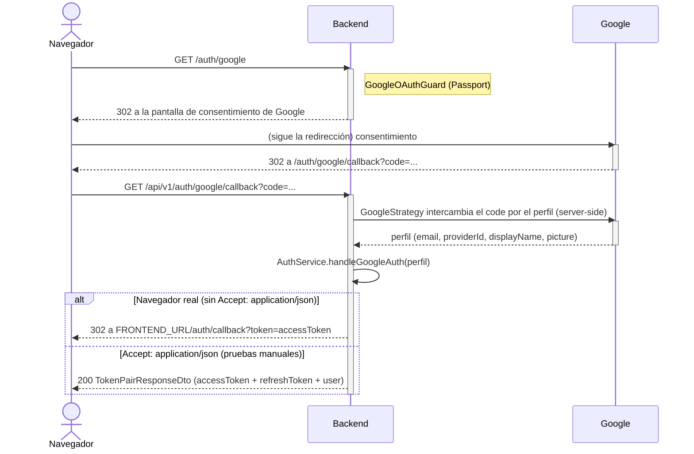
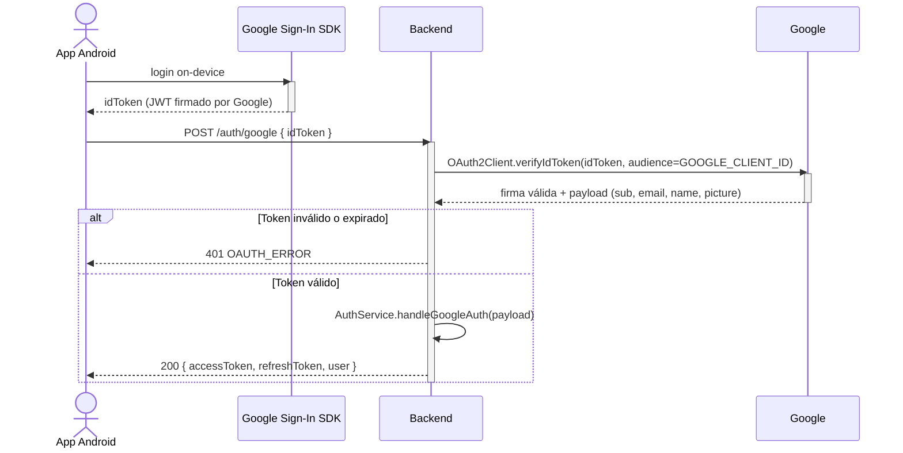

# Pandora — Interfaces entre Sistemas

Este documento detalla las interacciones entre el backend de Pandora (como sistema completo) y los sistemas externos de los que depende: PostgreSQL, Cloudinary, Google (OAuth), Resend y Lorem Picsum. No cubre la interfaz entre el backend y sus propios clientes de primera parte (Portal Web, App Android) — eso vive en [diseño de arquitectura](/diseno-arquitectura.md) §1 (vista general) y en [convenciones de API](/api-conventions.md) (contrato REST). Tampoco redocumenta el detalle interno de cada integración (eso vive en [clases de diseño](/clases-diseno.md), en las clases `StorageService`, `MailService` y `AuthService`) — el foco acá es el protocolo, la dirección y el comportamiento ante fallos de cada interfaz externa.

---

# 1. Resumen

| Sistema | Rol | Protocolo | Dirección | ¿Obligatorio para arrancar? | Modo de fallo |
|---|---|---|---|---|---|
| PostgreSQL | Almacenamiento primario de datos | TCP/SQL (TypeORM) | Backend → PostgreSQL | Sí | El proceso no arranca sin conexión a la base |
| Cloudinary | Almacenamiento/CDN de imágenes de obras | HTTPS REST (SDK oficial `cloudinary`) | Backend → Cloudinary | No (el proceso arranca igual) | Sin credenciales: cualquier subida responde `500 INTERNAL_SERVER_ERROR` explícito |
| Google | Identidad federada (login social) | OAuth2 authorization code (web) / verificación de ID token (Android) | Backend ↔ Google | No | Sin credenciales: las rutas `/auth/google*` fallan; login local no se ve afectado |
| Resend | Envío de correo transaccional | HTTPS REST (SDK oficial `resend`) | Backend → Resend | No | Sin API key: modo *log* local (el correo se imprime en logs, no se bloquea el flujo) |
| Lorem Picsum | Imágenes placeholder para el catálogo semilla | URL hotlink — **el backend no llama a Picsum**, sólo construye la URL | Cliente (navegador/app) → Picsum, referenciado por el backend | No | Si Picsum cae, sólo se ven rotas esas imágenes puntuales; no afecta al backend |

Sólo PostgreSQL es una dependencia dura de arranque. Las otras cuatro son deliberadamente *fail-soft* a nivel de proceso: el servidor levanta igual sin credenciales configuradas y sólo falla (o degrada) la operación puntual que las necesita — ver [diseño de arquitectura](/diseno-arquitectura.md) §3 para el detalle de logging de cada una.

---

# 2. PostgreSQL

Almacenamiento primario y única fuente de verdad de todo el dominio (usuarios, obras, cartas, moderación, notificaciones, etc. — ver [modelo de tablas](/modelo-tablas.md)). Acceso exclusivamente vía TypeORM (`@nestjs/typeorm`), nunca SQL crudo fuera de los casos puntuales ya documentados en las clases de diseño (subqueries de filtro en `ArtworksService`).

Configuración (`src/config/database.config.ts`, variables `PG*`): `PGHOST`, `PGPORT`, `PGUSER`, `PGPASSWORD`, `PGDATABASE`, `PGSSLMODE`, `PGCHANNELBINDING`. `DB_SYNC` controla si TypeORM sincroniza el esquema automáticamente contra las entidades (`true` por defecto fuera de `NODE_ENV=production`) — en producción se espera manejar el esquema por migraciones versionadas en vez de `synchronize`, tal como recomienda [diseño de arquitectura](/diseno-arquitectura.md) §8.10.

No hay *fallback*: si la conexión inicial falla, el proceso no llega a levantar el servidor HTTP.

---

# 3. Cloudinary (almacenamiento de imágenes)

**Rol:** almacenamiento y transformación de las imágenes de obra (`RNF06`). Encapsulado íntegramente en `StorageService` (`src/storage/storage.service.ts`) — Adapter: ningún otro service llama al SDK de Cloudinary directamente.

**Configuración:** `CLOUDINARY_CLOUD_NAME`, `CLOUDINARY_API_KEY`, `CLOUDINARY_API_SECRET` (`src/config/image.config.ts`). Si falta alguna, `StorageService` queda en estado "no configurado" (loguea un `warn` al construirse) — el proceso arranca igual, pero `uploadArtworkImage()` responde `500 INTERNAL_SERVER_ERROR` explícito en vez de intentar la subida.

## 3.1 Subida (`uploadArtworkImage`)

```text
ArtworksService.create()/update()
  │
  ▼
StorageService.uploadArtworkImage(file)
  │
  ▼
cloudinary.uploader.upload_stream(buffer)  — carpeta pandora/artworks
  │
  ▼
{ public_id, secure_url }
  │
  ├──► originalUrl = secure_url (tal cual la subió Cloudinary)
  ├──► mediumUrl    = cloudinary.url(public_id, width=1080, crop=limit, quality=auto, fetch_format=auto)
  └──► thumbnailUrl = cloudinary.url(public_id, width=300×300, crop=fill, gravity=auto, quality=auto, fetch_format=auto)
```

`mediumUrl`/`thumbnailUrl` son transformaciones *on-the-fly* del mismo `public_id` — no se generan ni almacenan archivos adicionales; Cloudinary las renderiza (y cachea) la primera vez que alguien pide esa URL.

## 3.2 Borrado (`deleteArtworkImage`)

`cloudinary.uploader.destroy(publicId)`, invocado al reemplazar la imagen de una obra en una edición y al eliminarla. Es **best-effort**: un fallo se loguea (`this.logger.error`) pero nunca aborta la operación principal — la obra ya se guardó o se marcó eliminada independientemente de si Cloudinary logró borrar el recurso asociado.

## 3.3 Límite conocido

La validación de tipo de archivo (`buildImageValidationPipe`) ocurre *antes* de llegar a Cloudinary, basada en el `mimetype` que reporta el cliente — no en un análisis de los primeros bytes del archivo. Cloudinary en sí no se usa como mecanismo de validación de contenido.

---

# 4. Google (identidad federada / OAuth)

**Rol:** login social opcional, alternativa a email + contraseña. Dos flujos distintos según el cliente, que convergen en la misma lógica de vinculación de cuenta.

**Configuración:** `GOOGLE_CLIENT_ID`, `GOOGLE_CLIENT_SECRET`, `GOOGLE_CALLBACK_URL` (`src/config/google.config.ts`). Sin `GOOGLE_CLIENT_ID`/`GOOGLE_CLIENT_SECRET`, `GoogleStrategy` igual se registra (con placeholders `dummy-google-*`) pero cualquier intento real de autenticar contra Google falla del lado de Google, no del backend.

## 4.1 Flujo Web — *authorization code* (Passport)



`GoogleOAuthGuard` (`AuthGuard('google')` de Passport) cubre tanto `GET /auth/google` (redirección inicial) como `GET /auth/google/callback` (donde Google redirige de vuelta con el `code`). `GoogleStrategy.validate()` sólo mapea el perfil recibido a una forma interna (`providerId`, `email`, `displayName`, `picture`) — es `AuthController.googleAuthCallback()` quien pasa ese perfil a `AuthService.handleGoogleAuth()`.

El callback responde de dos formas distintas según el header `Accept` de quien llamó:
- **Navegador real** (sin `Accept: application/json`): `302` a `${FRONTEND_URL}/auth/callback?token=<accessToken>` — el frontend toma el token de la query string. Nota: el `refreshToken` **no** viaja en esta redirección (queda fuera de la URL por diseño, ya que terminaría en el historial del navegador y en logs de servidores intermedios); el frontend web debe volver a autenticarse cuando ese `accessToken` expire.
- **Cliente que pide JSON explícitamente** (`Accept: application/json`, p. ej. pruebas manuales): `200` con el mismo `TokenPairResponseDto` que el resto de los flujos de auth (`accessToken` + `refreshToken` + `user`).

## 4.2 Flujo Android — verificación de ID token

La app Android usa el SDK nativo de Google Sign-In para autenticar *on-device* y obtiene un ID token (JWT) firmado por Google directamente — nunca pasa por el flujo de redirección web.



`POST /auth/google` (`AuthController.googleLoginDirect`) delega en `AuthService.loginWithGoogleIdToken(idToken)`, que usa `google-auth-library` (`OAuth2Client.verifyIdToken`) para verificar la firma y la `audience` (`GOOGLE_CLIENT_ID`) del token recibido — esta es la única llamada de red que el backend mismo hace contra Google (a diferencia del flujo web, donde el intercambio code→perfil lo hace Passport dentro del mismo request de callback, pero sigue siendo el backend quien lo dispara). Un token inválido o expirado responde `401 OAUTH_ERROR`.

## 4.3 Vinculación de cuenta (común a ambos flujos)

Ambos flujos terminan en `AuthService.handleGoogleAuth(googleUser)`:

1. Busca `OAuthAccount` por `(provider='google', provider_user_id)`. Si existe, usa esa cuenta (bloqueando sólo si está `SUSPENDED`; `BANNED` puede autenticarse — ver [clases de diseño](/clases-diseno.md) §20.2).
2. Si no existe el vínculo, busca un `User` por email. Si ya existía (registrado con contraseña local, por ejemplo), lo vincula a esta cuenta de Google y marca `email_verified = true` (Google ya verificó ese correo por su cuenta).
3. Si tampoco existe el usuario, lo crea: username derivado del `displayName`/email (normalizado, con sufijo numérico si hay colisión), sin `password_hash` (login exclusivamente por Google desde entonces, salvo que más adelante use "forgot password" — ver nota en §5.2), `email_verified = true`, rol `user` por defecto.
4. Emite el mismo par `accessToken`/`refreshToken` que cualquier otro login.

**Scope solicitado:** `email profile` (`google.strategy.ts`) — lo mínimo necesario para email, nombre y foto de perfil.

---

# 5. Resend (correo transaccional)

**Rol:** envío de los dos correos transaccionales del sistema — verificación de email (`RF02`/`RNF07`) y recuperación de contraseña. Encapsulado en `MailService` (`src/mail/mail.service.ts`) — Adapter, mismo patrón que `StorageService`.

**Configuración:** `RESEND_API_KEY`, `MAIL_FROM` (`src/config/mail.config.ts`). Sin `RESEND_API_KEY`, `MailService` opera en **modo LOCAL/LOGGER**: en vez de llamar a la API de Resend, imprime el contenido simulado del correo (destinatario, usuario, token, URL) en los logs — pensado para desarrollar sin depender de una cuenta real de Resend.

## 5.1 Correos enviados

| Correo | Disparado por | Enlace incluido | Vigencia del token |
|---|---|---|---|
| Verificación de cuenta | `AuthService.register()`, `resendVerification()` | `${FRONTEND_URL}/verify-email?token=...` | 24 horas |
| Recuperación de contraseña | `AuthService.forgotPassword()` | `${FRONTEND_URL}/reset-password?token=...` | 1 hora |

Ambos enlaces apuntan al frontend (no directamente a un endpoint del backend): es el frontend quien lee el `token` de la URL y lo manda en el body de `POST /auth/verify-email` / `POST /auth/reset-password` — el correo en sí nunca llama al backend.

## 5.2 Manejo de fallos

Un error de la API de Resend (o una excepción de red) se loguea pero **nunca** se propaga como excepción hacia quien llamó — `register()`/`resendVerification()`/`forgotPassword()` responden éxito igual, sea que el correo se haya enviado, haya fallado, o esté en modo LOCAL/LOGGER. Esto es consistente con el patrón anti-enumeración de `AuthService` ([clases de diseño](/clases-diseno.md) §20.2): `forgotPassword()` responde el mismo mensaje neutro exista o no la cuenta, así que un fallo de Resend tampoco puede filtrar esa información por la vía de "la respuesta tardó más" o "devolvió otro código".

**Cuenta creada por Google, sin contraseña local:** `forgotPassword()` sobre esa cuenta no emite `PasswordResetToken` (no hay contraseña local que recuperar) pero igual responde el mensaje neutro — no hay forma de distinguir desde afuera "no existe la cuenta" de "existe pero es sólo-Google".

---

# 6. Lorem Picsum (`picsum.photos`)

**Rol:** imágenes placeholder para el catálogo "de sistema" que garantiza que siempre exista al menos una carta de cada rareza (`RARITY_SEED_CATALOG`, `src/cards/rarity-seed-catalog.ts`). **El backend nunca hace una petición HTTP a Picsum** — sólo construye una URL determinística (`https://picsum.photos/seed/pandora-<rareza>/600/800`) y la guarda como `image_original_url`/`image_medium_url`/`image_thumbnail_url` de esas obras semilla. Quien efectivamente descarga la imagen es el navegador/app del usuario final, al renderizar esa URL — igual que cualquier otra imagen servida por Cloudinary.

Dos consumidores comparten esta función:

- **`CardCatalogSeederService`** (`onApplicationBootstrap`): corre en **cada arranque del servidor, en cualquier ambiente** (no es un script manual) — autorepara el catálogo de rarezas bajo la cuenta de sistema `pandora` si falta alguna.
- **`scripts/seed-admin-catalog.ts`** (ejecución manual, sólo desarrollo): mismo mecanismo, bajo la cuenta admin real — ver `docs/scripts-inicializacion.md`.

**Por qué Picsum y no Cloudinary acá:** deliberado — el arranque del servidor (y el autoreparado del catálogo mínimo) no debe depender de que `CLOUDINARY_*` esté configurado. Usar un hotlink público y determinístico evita acoplar el arranque a credenciales externas y no consume cuota de Cloudinary en cada reinicio.

Si Picsum estuviera caído, el único efecto visible es que esas imágenes puntuales (obras semilla, no las de la comunidad) se ven rotas hasta que Picsum vuelva — no afecta la disponibilidad del backend ni de ninguna otra imagen.

---

# 7. Consideraciones transversales

- **Aislamiento en Adapters:** las dos integraciones con SDK propio (Cloudinary, Resend) están encapsuladas cada una en un único service (`StorageService`, `MailService`); ningún service de dominio importa esos SDKs directamente. Google es la excepción parcial: `GoogleStrategy` (Passport) y `AuthService.loginWithGoogleIdToken` (`google-auth-library`) son dos puntos de integración distintos porque son, en los hechos, dos protocolos distintos con el mismo proveedor (ver §4).
- **Fail-soft de proceso, fail-hard de operación:** salvo PostgreSQL, ninguna de estas dependencias impide que el servidor arranque sin estar configurada. Lo que sí varía es qué tan visible es la degradación: Cloudinary responde un error explícito en la subida puntual (sin imagen no hay obra que crear — es un error duro para esa request), mientras que Resend y Picsum degradan silenciosamente (modo log / imagen rota) porque su ausencia no impide que la operación de negocio en sí (registrarse, tener un catálogo mínimo) se complete.
- **Ninguna integración externa es de confianza para autorización:** Google verifica identidad, no permisos — el rol (`user` por defecto) lo asigna el backend al crear la cuenta, igual que en el registro local.
- **Quién puede llamarnos vs. a quién llamamos:** este documento cubre las dependencias salientes del backend. La contracara — qué orígenes pueden consumir la API — es una única regla de CORS restringida a `FRONTEND_URL`, sin `credentials` (autenticación por Bearer token, no por cookies) — ver `src/main.ts`. La app Android no pasa por CORS (no es un contexto de navegador).
